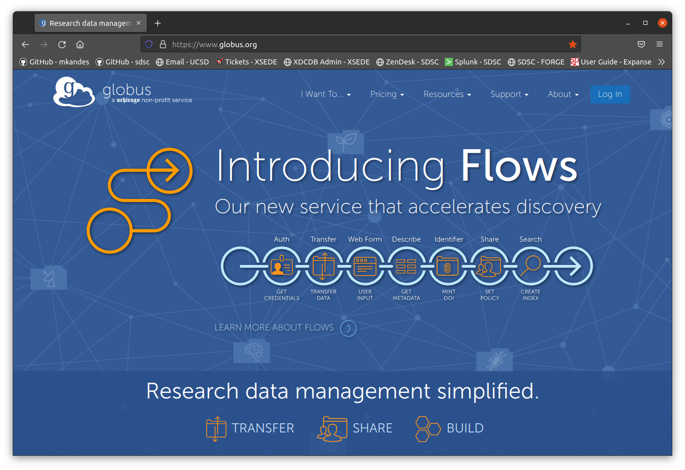
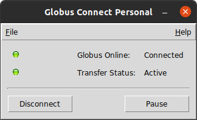
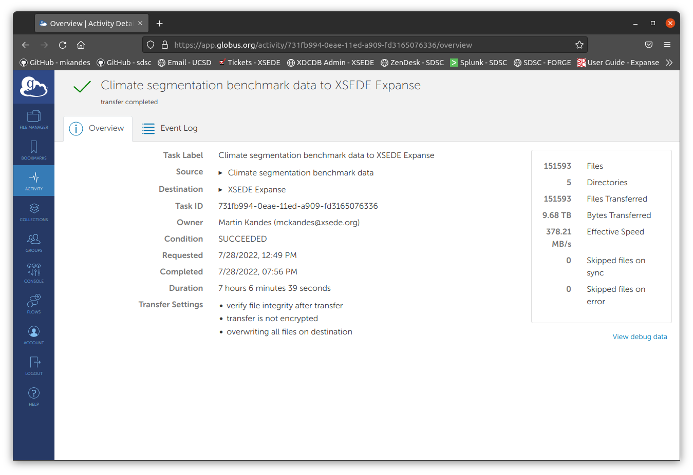

# Data Management: Or how (not) to handle your data in an HPC environment

- [Before we begin: A few disclaimers](DISCLAIMERS.md)
- [Easy access: Setting up SSH keys](SSH.md)
- [CIFAR through the tubes: Downloading data from the internet](DOWNLOADING.md)
- [More files, more problems: Advantages and limitations of different filesystems](FILESYSTEMS.md)
- [Going parallel: Lustre basics](LUSTRE.md)
- [Back that data up: Data transfer tools](TRANSFER.md)

## Back that data up: Data transfer tools


### scp - OpenSSH secure file copy

```
$ scp expanse:~/CIFAR-10-images.zip ./
CIFAR-10-images.zip                           100%   77MB  20.8MB/s   00:03    
$ ls
 CIFAR-10-images.zip   Downloads   Pictures   Templates
 Desktop               Dropbox     Public     Videos
 Documents             Music       snap      'VirtualBox VMs'
$ md5sum CIFAR-10-images.zip 
072722c0adb133f80ce1e96c60439470  CIFAR-10-images.zip
```

```
$ scp -r expanse:~/cifar-10-batches-py/ ./
test_batch                                    100%   30MB  16.4MB/s   00:01    
data_batch_3                                  100%   30MB  23.7MB/s   00:01    
data_batch_4                                  100%   30MB  23.2MB/s   00:01    
readme.html                                   100%   88     1.2KB/s   00:00    
data_batch_1                                  100%   30MB  22.4MB/s   00:01    
data_batch_5                                  100%   30MB  21.3MB/s   00:01    
batches.meta                                  100%  158     2.0KB/s   00:00    
data_batch_2                                  100%   30MB  22.6MB/s   00:01
$ ls
 cifar-10-batches-py   Documents   Music      snap       'VirtualBox VMs'
 CIFAR-10-images.zip   Downloads   Pictures   Templates
 Desktop               Dropbox     Public     Videos
```

### sftp - OpenSSH secure file transfer

```
$ sftp expanse
Connected to expanse.
sftp> pwd
Remote working directory: /home/xdtr108
sftp> lpwd
Local working directory: /home/mkandes
sftp> cd /expanse/lustre/scratch/xdtr108/temp_project/
sftp> ls
CIFAR-10-images.tar.gz    ILSVRC2012_img_val.tar    gene_info.gz              
striped                   
sftp> get gene_info.gz
Fetching /expanse/lustre/scratch/xdtr108/temp_project/gene_info.gz to gene_info.gz
/expanse/lustre/scratch/xdtr108/temp_project/ 100%  791MB  22.5MB/s   00:35    
sftp> put CIFAR-10-images.zip
Uploading CIFAR-10-images.zip to /expanse/lustre/scratch/xdtr108/temp_project/CIFAR-10-images.zip
CIFAR-10-images.zip                           100%   77MB   2.8MB/s   00:27    
sftp> ls
CIFAR-10-images.tar.gz    CIFAR-10-images.zip       ILSVRC2012_img_val.tar    
gene_info.gz              striped                   
sftp> exit
$ ls
 cifar-10-batches-py   Documents   gene_info.gz   Public      Videos
 CIFAR-10-images.zip   Downloads   Music          snap       'VirtualBox VMs'
 Desktop               Dropbox     Pictures       Templates
```

```
$ sftp xdtr108@oasis-dm-interactive.sdsc.edu
Connected to oasis-dm-interactive.sdsc.edu.
sftp> get /expanse/lustre/scratch/xdtr108/temp_project/ILSVRC2012_img_val.tar
Fetching /expanse/lustre/scratch/xdtr108/temp_project/ILSVRC2012_img_val.tar to ILSVRC2012_img_val.tar
/expanse/lustre/scratch/xdtr108/temp_project/ 100% 6432MB  24.1MB/s   04:26    
sftp> exit
$
```


### lftp - Another (sophisticated) file transfer program

```
$ lftp sftp://xdtr108@oasis-dm-interactive.sdsc.edu
Password: 
lftp xdtr108@oasis-dm-interactive.sdsc.edu:~> pget -n 8 /expanse/lustre/scratch/xdtr108/temp_project/ILSVRC2012_img_val.tar
6744924160 bytes transferred in 153 seconds (42.16 MiB/s)                      
lftp xdtr108@oasis-dm-interactive.sdsc.edu:~> exit                             
$
```

### Globus - Secure, reliable research data management

- https://www.globus.org




```
$ globus endpoint search 'XSEDE Expanse'
ID                                   | Owner              | Display Name                                              
------------------------------------ | ------------------ | ----------------------------------------------------------
b256c034-1578-11eb-893e-0a5521ff3f4b | xsede@globusid.org | XSEDE Expanse                                             
9ca935c8-2deb-11ec-95dc-853490a236f9 | cosmic2@xsede.org  | COSMIC2 Science Gateway storage on XSEDE Expanse          
2552f468-2dec-11ec-95dc-853490a236f9 | cosmic2@xsede.org  | COSMIC2 Science Gateway storage on XSEDE Expanse (staging)
d74d0ede-4402-11ec-a9c7-91e0e7641750 | sivagnan@xsede.org | NSG private share for Simon on Expanse                    
0d0ad3e4-4403-11ec-a6bf-9b4f84e67de8 | sivagnan@xsede.org | NSG public share for Simon on Expanse
```



```
$ globus endpoint search 'hardtack'
ID                                   | Owner              | Display Name
------------------------------------ | ------------------ | ------------
6d66770e-0e95-11ed-8dae-9f359c660fbd | mckandes@xsede.org | hardtack
```

```
$ export SOURCE_ENDPOINT_ID='b256c034-1578-11eb-893e-0a5521ff3f4b'
mkandes@hardtack:~$ export DEST_ENDPOINT_ID='6d66770e-0e95-11ed-8dae-9f359c660fbd'
mkandes@hardtack:~$ globus transfer "${SOURCE_ENDPOINT_ID}:/expanse/lustre/scratch/mkandes/temp_project/ILSVRC2012_img_val.tar" "${DEST_ENDPOINT_ID}:~/ILSVRC2012_img_val.tar"
Message: The transfer has been accepted and a task has been created and queued for execution
Task ID: 551a8ecc-0eab-11ed-8dae-9f359c660fbd
```

```
$ globus task show 551a8ecc-0eab-11ed-8dae-9f359c660fbd
Label:                        None
Task ID:                      551a8ecc-0eab-11ed-8dae-9f359c660fbd
Is Paused:                    False
Type:                         TRANSFER
Directories:                  0
Files:                        1
Status:                       ACTIVE
Request Time:                 2022-07-28T19:27:35+00:00
Faults:                       0
Total Subtasks:               2
Subtasks Succeeded:           1
Subtasks Pending:             1
Subtasks Retrying:            0
Subtasks Failed:              0
Subtasks Canceled:            0
Subtasks Expired:             0
Subtasks with Skipped Errors: 0
Deadline:                     2022-07-29T19:27:35+00:00
Details:                      OK
Source Endpoint:              XSEDE Expanse
Source Endpoint ID:           b256c034-1578-11eb-893e-0a5521ff3f4b
Destination Endpoint:         hardtack
Destination Endpoint ID:      6d66770e-0e95-11ed-8dae-9f359c660fbd
Bytes Transferred:            0
Bytes Per Second:             0
```

```
$ globus task show 551a8ecc-0eab-11ed-8dae-9f359c660fbd
Label:                        None
Task ID:                      551a8ecc-0eab-11ed-8dae-9f359c660fbd
Is Paused:                    False
Type:                         TRANSFER
Directories:                  0
Files:                        1
Status:                       SUCCEEDED
Request Time:                 2022-07-28T19:27:35+00:00
Faults:                       0
Total Subtasks:               2
Subtasks Succeeded:           2
Subtasks Pending:             0
Subtasks Retrying:            0
Subtasks Failed:              0
Subtasks Canceled:            0
Subtasks Expired:             0
Subtasks with Skipped Errors: 0
Completion Time:              2022-07-28T19:30:59+00:00
Source Endpoint:              XSEDE Expanse
Source Endpoint ID:           b256c034-1578-11eb-893e-0a5521ff3f4b
Destination Endpoint:         hardtack
Destination Endpoint ID:      6d66770e-0e95-11ed-8dae-9f359c660fbd
Bytes Transferred:            6744924160
Bytes Per Second:             33060759
```

```
$ globus endpoint search 'XSEDE TACC Stampede2'
ID                                   | Owner              | Display Name        
------------------------------------ | ------------------ | --------------------
ceea5ca0-89a9-11e7-a97f-22000a92523b | xsede@globusid.org | XSEDE TACC stampede2
$ export DEST_ENDPOINT_ID='ceea5ca0-89a9-11e7-a97f-22000a92523b'
$ globus transfer "${SOURCE_ENDPOINT_ID}:/expanse/lustre/scratch/mkandes/temp_project/ILSVRC2012_img_val.tar" "${DEST_ENDPOINT_ID}:/work2/03216/mckandes/stampede2/ILSVRC2012_img_val.tar"
Message: The transfer has been accepted and a task has been created and queued for execution
Task ID: 1b4546a0-0eac-11ed-8dae-9f359c660fbd
$ globus task show 1b4546a0-0eac-11ed-8dae-9f359c660fbd
Label:                        None
Task ID:                      1b4546a0-0eac-11ed-8dae-9f359c660fbd
Is Paused:                    False
Type:                         TRANSFER
Directories:                  0
Files:                        1
Status:                       SUCCEEDED
Request Time:                 2022-07-28T19:33:07+00:00
Faults:                       0
Total Subtasks:               2
Subtasks Succeeded:           2
Subtasks Pending:             0
Subtasks Retrying:            0
Subtasks Failed:              0
Subtasks Canceled:            0
Subtasks Expired:             0
Subtasks with Skipped Errors: 0
Completion Time:              2022-07-28T19:33:34+00:00
Source Endpoint:              XSEDE Expanse
Source Endpoint ID:           b256c034-1578-11eb-893e-0a5521ff3f4b
Destination Endpoint:         XSEDE TACC stampede2
Destination Endpoint ID:      ceea5ca0-89a9-11e7-a97f-22000a92523b
Bytes Transferred:            6744924160
Bytes Per Second:             255829087
```

```
https://github.com/mlcommons/training_policies/blob/master/hpc_training_rules.adoc#31-closed-division
```

```
https://github.com/mlcommons/hpc/tree/main/deepcam#dataset
```




[Image Credit: Amazon Web Services](https://aws.amazon.com/snowmobile)

### Long-term, archival data storage

Magnetic tape is still a thing. 

- [TACC Ranch](https://portal.xsede.org/tacc-ranch): Ranch is fundamentally implemented using long-term tape storage and as such is designed for archiving data that is in a state wherein the data will not likely change, and will not likely need to be accessed very often.

Send your data to the cloud!

- [Amazon S3](https://en.wikipedia.org/wiki/Amazon_S3)
- [Jetstream2 (S3-like) Object Storage](https://portal.xsede.org/jetstream2#storage:objectstore)

Run your own NAS. 


